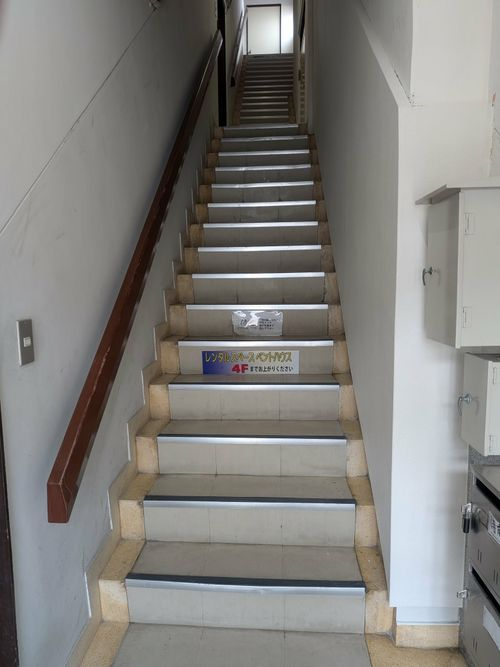
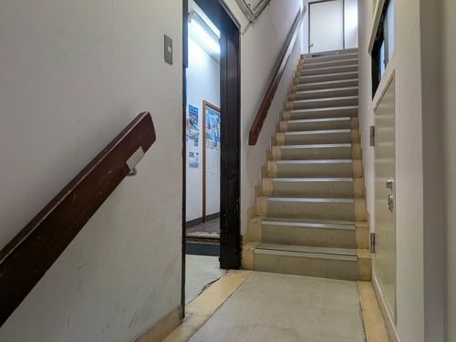
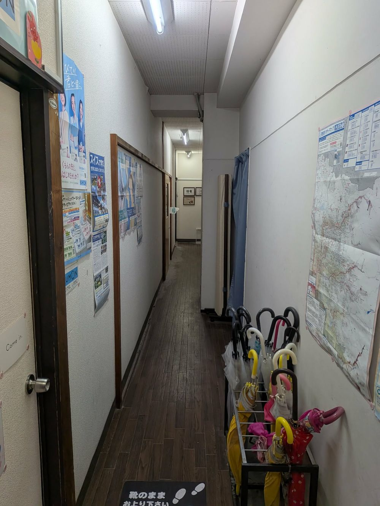
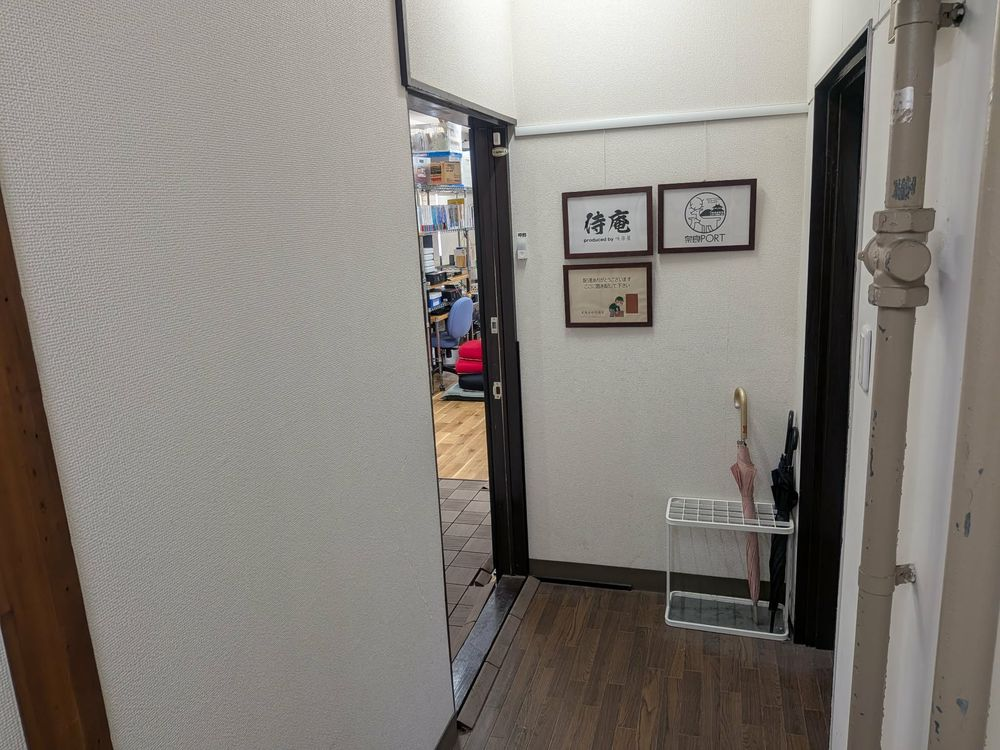

# 侍庵への行き方

## 1. [Google Mapsを頼りにこちらまで](https://maps.app.goo.gl/BLLWqcUmGLEoN6GFA)お越しください。
## 2. 近鉄奈良駅近くの高天交差点から北方向に進み、KUMONの看板が左に見えるまで進みます。画像の右側にあるKUMONの表示のあるドアをお入りください。

## 3. 入ってすぐに階段がありますので、ここを上ります。

## 4. 左手に入り口が見えますので、左に入ります。

## 5. 入ってすぐ右手に廊下がありますが、靴のまま上がりまっすぐ進みます。

## 6. 侍庵の表示がある左手のドアをお入りください。ドアが開いてなければインターフォンのボタンを押してください。

